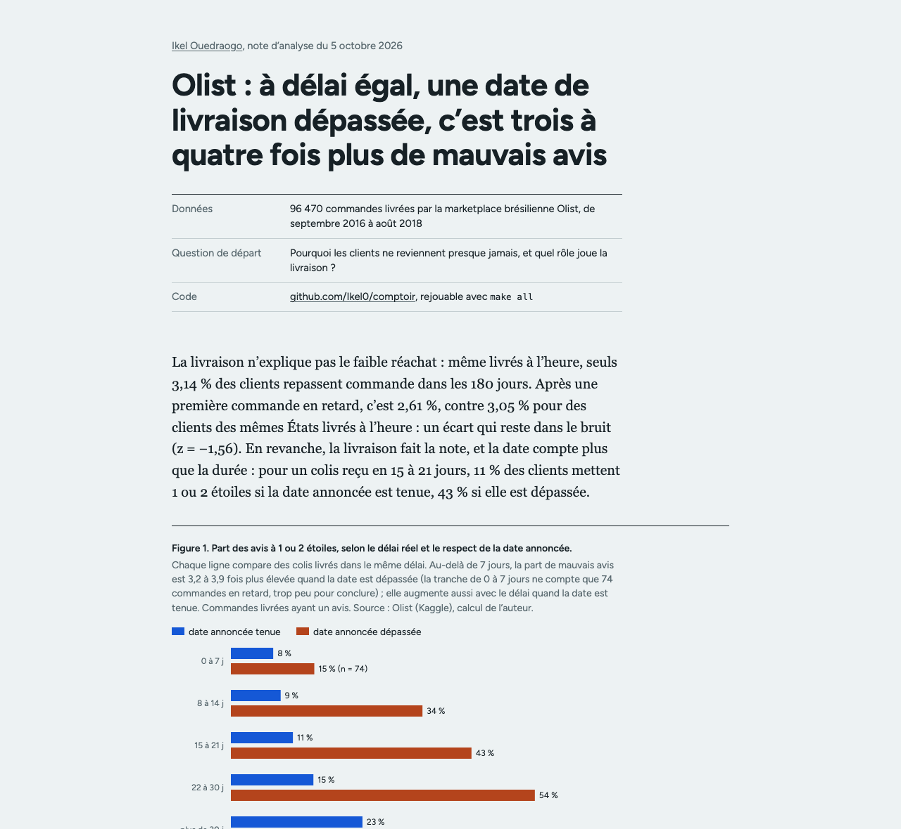

# Comptoir

Étude analytics de bout en bout sur 96 470 commandes de la marketplace brésilienne Olist (2016-2018) : le coût d'une date de livraison non tenue, et pourquoi la livraison n'explique pas le faible réachat.

Étude en ligne : https://ikel0.github.io/comptoir/



## Ce que l'étude trouve

- Le réachat à 180 jours est de 3,1 %. Une première livraison en retard ne le fait pas baisser de façon mesurable une fois l'État du client pris en compte.
- À délai réel égal, le dépassement de la date annoncée multiplie par 4 la part d'avis à 1 ou 2 étoiles (11 % contre 43 % pour un colis reçu en 15 à 21 jours).
- 29 % des avis à 1 ou 2 étoiles sont déposés avant la livraison, parce que le questionnaire part à la date estimée.
- Recalculer la date annoncée par trajet ne fait pas mieux qu'Olist à durée égale (testé sur 2018 après calibration sur 2017). Ajouter 5 jours sur 25 trajets à risque retire 12 % des retards pour un jour de promesse en plus.

## Lancer

Python 3 (testé avec 3.13).

```bash
make all
make serve
```

`make all` télécharge l'archive Olist depuis Kaggle (44,7 Mo, sans compte), vérifie son empreinte SHA-256, la charge dans DuckDB, construit et teste les modèles dbt, calcule les chiffres de l'étude, vérifie que le texte de la page et les données concordent, puis recalcule à part la grille de marges de la figure 3. `make serve` sert l'étude sur http://localhost:8000.

## Comment c'est construit

| Étape | Fichier | Rôle |
|---|---|---|
| Ingestion | `ingest.py` | Télécharge, vérifie l'empreinte, charge les CSV en texte dans `raw`, arrête si une colonne attendue manque |
| Modèles | `models/` | dbt : 7 vues de staging typées, 2 vues intermédiaires, 9 tables (faits, dimensions, marts d'analyse) |
| Tests | `models/*/schema.yml`, `tests/` | 40 tests dbt : clés, relations, valeurs admises, cohérence paiement / panier, dates impossibles |
| Indicateurs | `METRICS.md` | Définition, grain et piège de chaque indicateur |
| Analyse | `analysis.py` | Lit les marts, écrit tous les chiffres dans `site/data/results.json`, y compris le test des règles de promesse et la grille des marges de 0 à 10 jours |
| Étude | `site/` | Page statique : texte, graphiques SVG dont chaque barre se lit au survol, au toucher ou au clavier, marge réglable qui ne lit que la grille calculée, table des trajets filtrable |
| Contrôle | `check_numbers.py` | Compare chaque chiffre écrit dans la page à `results.json` |
| Test | `test_backtest.py` | Recalcule en Python, depuis `fct_orders`, chaque marge de la grille et la compare à `results.json` |
| CI | `.github/workflows/ci.yml` | Rejoue `make all` à chaque push et publie `site/` sur GitHub Pages |

DuckDB plutôt qu'un entrepôt cloud : les sept fichiers chargés pèsent 65 Mo, l'étude se rejoue en une commande sur un portable et en CI sans identifiants.

## Limites

- Les résultats sont des corrélations. Le nombre d'avis négatifs évités est une estimation qui suppose qu'une commande se comporte comme les commandes de 2017 de même délai réel et de même statut par rapport à la date.
- Rallonger la date annoncée peut faire perdre des ventes ; les données ne contiennent pas les visites sans achat, cet effet n'est pas mesuré.
- Les commandes à plusieurs vendeurs (1,3 %) sont exclues des calculs par trajet : Olist ne date pas chaque colis.

## Données et licence

[Brazilian E-Commerce Public Dataset by Olist](https://www.kaggle.com/datasets/olistbr/brazilian-ecommerce), licence CC BY-NC-SA 4.0. Les données brutes ne sont pas versionnées. Les données dérivées publiées dans `site/data/` suivent la même licence. Le code est sous licence MIT.
